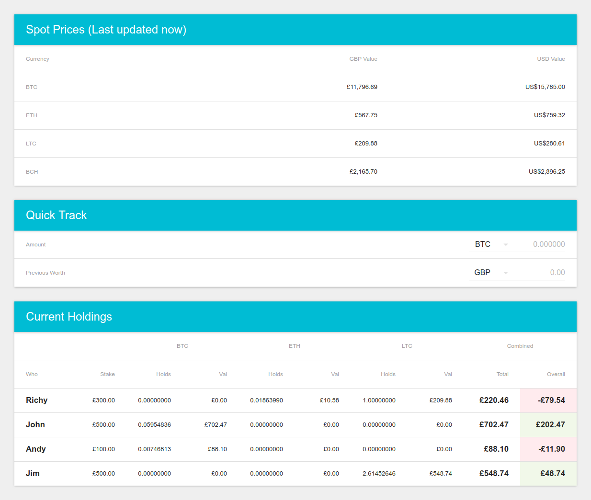
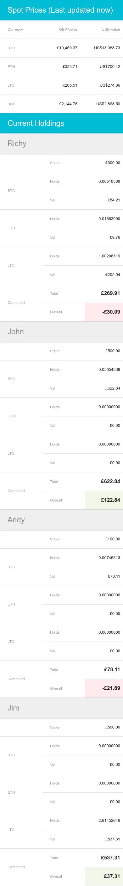

# Crypto Currency Tracker

Front end for displaying crypto currency spot prices and the current holdings
of supplied persons amounts of each currency.

This project was bootstrapped with [Create React App](https://github.com/facebookincubator/create-react-app).



### Development

```
yarn install
yarn start
```
or
```
npm install
npm start
```

### Build
creates a static version of the app in the `build` directory

```
yarn install
yarn build
```
or
```
npm install
npm build
```


### Data

This app calls a backend service to supply it with data in the following [format](./docs/response.example.json)

By default the url to the backend is defined as the Environment Variable
```
REACT_APP_BACKEND_URL=https://binaryitch.co.uk/dev/coinbase/raw.php
REACT_APP_BACKEND_POLL_INTERVAL=10000 //time between calls to the backend to update data (milliseconds)
REACT_APP_LAST_UPDATED_INTERVAL=5000  //interval it informs you how long it's been since it last updated (milliseconds)
```

you can override these by creating an `.env.local` file.

**Note:** you'll need to restart your development server when changing these values and/or rebuild the app for production.


### Responsive example


